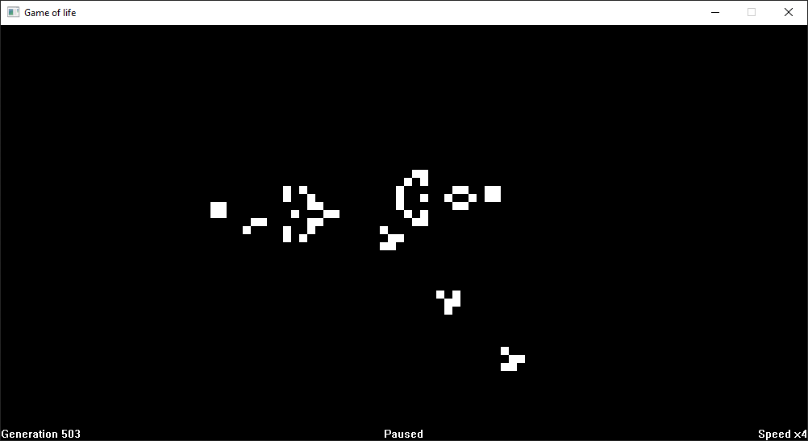

# GameOfLife-Win32

A Win32 implementation of Conway's game of life in C 

## Controls
- **Space:** Pause
- **Right Arrow:** Next generation
- **Up/Down Arrow:** Increase/decrease speed
- **R:** Reset

## Building

Open the folder in [Visual Studio Developer Command Prompt](https://docs.microsoft.com/en-us/visualstudio/ide/reference/command-prompt-powershell) and run `nmake`
